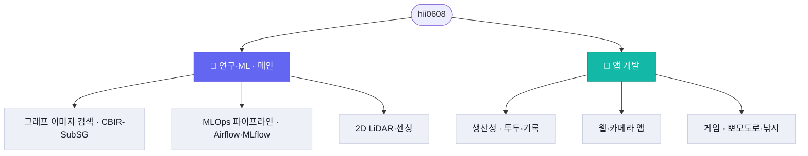

# 안녕하세요, hii0608 입니다 👋

- 🔬 **메인은 그래프 기반 머신러닝**(장면 그래프·서브그래프 학습) 이미지 검색 연구입니다.
- ⚙️ **MLOps 파이프라인**(Airflow·MLflow·Docker)으로 모델의 학습–추적–서빙을 다룹니다.
- 🧩 그 외에 웹·모바일·데스크톱·게임까지, 아이디어를 직접 만들어 봅니다.

🔗 **인터랙티브 포트폴리오:** <https://hii0608.github.io>
