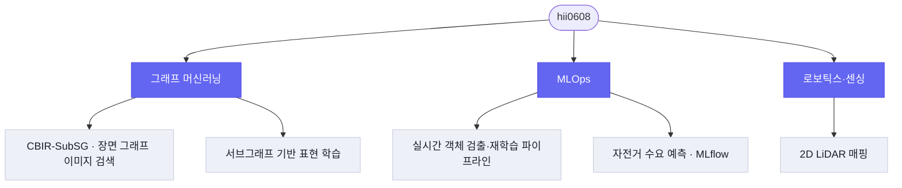

# 안녕하세요, hii0608 입니다 👋

- 🔬 **그래프 기반 머신러닝**(장면 그래프·서브그래프 학습)으로 이미지 검색을 연구했습니다.
- ⚙️ **MLOps 파이프라인**(Airflow·MLflow·Docker)으로 모델의 학습–추적–서빙을 다룹니다.
- 🤖 센싱·로보틱스부터 시계열 예측까지, 데이터가 흐르는 문제를 좋아합니다.

🔗 **인터랙티브 포트폴리오:** <https://hii0608.github.io>
